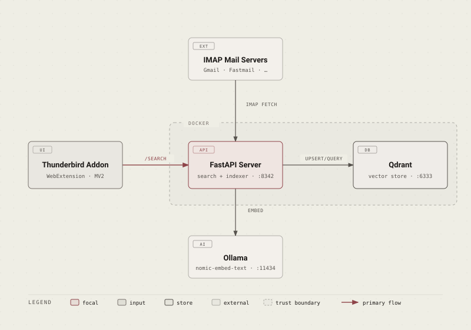
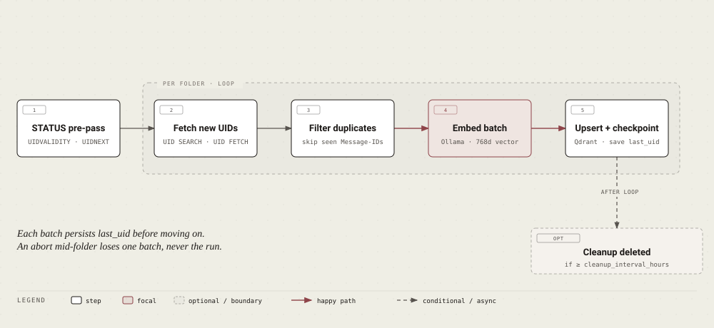

<p align="center">
  
</p>

<h1 align="center">Thunderbird AI Search</h1>

<p align="center">
  <a href="https://github.com/giovi321/thunderbird-ai-search/actions/workflows/docs.yml"></a>
  <a href="LICENSE"></a>
  
  
</p>

Semantic email search for Thunderbird. A local server pulls your mail over IMAP, embeds it with [Ollama](https://ollama.ai), and stores the vectors in Qdrant. A Thunderbird addon talks to that server so you can search by meaning and open matching messages directly.

**Everything runs on your machine. No cloud APIs, no data sent anywhere.**

<p align="center">
  
</p>

## Quick start

```bash
# 1. Pull the embedding model
ollama pull nomic-embed-text

# 2. Clone and configure
git clone https://github.com/giovi321/thunderbird-ai-search.git
cd thunderbird-ai-search
cp config.example.yaml config.yaml
# edit config.yaml — add your IMAP account details

# 3. Start
docker compose up -d
```

Verify:
```bash
curl http://localhost:8342/health
# {"qdrant":"ok","ollama":"ok"}
```

Then package and install the addon:
```bash
cd addon && zip -r ../ai-email-search.xpi * && cd ..
```
In Thunderbird: **Tools → Add-ons and Themes → gear → Install Add-on From File** → select `ai-email-search.xpi`.

Full setup guide → [giovi321.github.io/thunderbird-ai-search](https://giovi321.github.io/thunderbird-ai-search/getting-started/installation/)

## How it works

The server runs in Docker and does two things:

- **Search API** — takes a natural-language query from the addon, asks Ollama to embed it, and returns the closest vectors from Qdrant.
- **Indexer** — connects to your IMAP servers, downloads new mail, asks Ollama for embedding vectors, and writes them to Qdrant. Runs on startup and re-runs every 15 minutes by default.

<p align="center">
  
</p>

## Tech stack

| Component | Technology |
|-----------|------------|
| Server | Python + FastAPI |
| Vector store | Qdrant |
| Embeddings | Ollama (`nomic-embed-text`, 768d) |
| Addon | Thunderbird WebExtension MV2 |
| Deployment | Docker Compose |

## Prerequisites

- [Docker](https://docker.com) and Docker Compose
- [Ollama](https://ollama.ai) running on the Docker host
- [Thunderbird](https://www.thunderbird.net/) 128+

## Documentation

Full documentation at **[giovi321.github.io/thunderbird-ai-search](https://giovi321.github.io/thunderbird-ai-search)**:

- [Installation](https://giovi321.github.io/thunderbird-ai-search/getting-started/installation/)
- [Configuration reference](https://giovi321.github.io/thunderbird-ai-search/getting-started/configuration/)
- [Gmail setup](https://giovi321.github.io/thunderbird-ai-search/guides/gmail/)
- [How indexing works](https://giovi321.github.io/thunderbird-ai-search/guides/indexing/)
- [API reference](https://giovi321.github.io/thunderbird-ai-search/reference/api/)
- [Troubleshooting](https://giovi321.github.io/thunderbird-ai-search/reference/troubleshooting/)

## License

MIT
